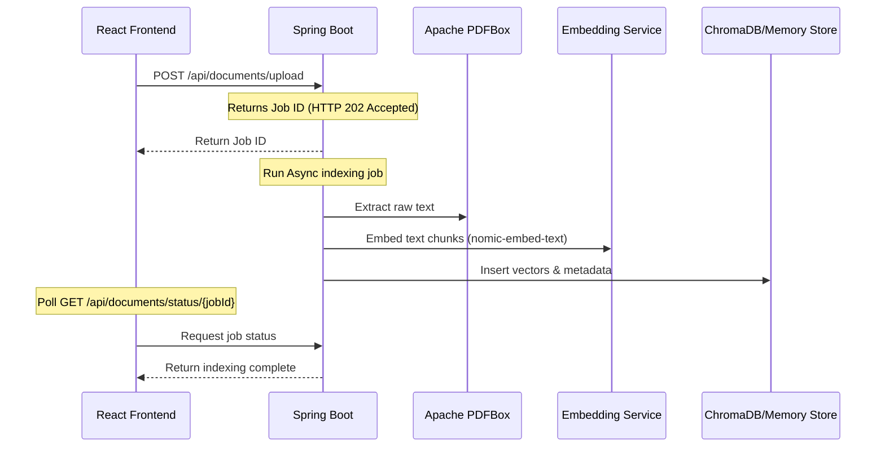
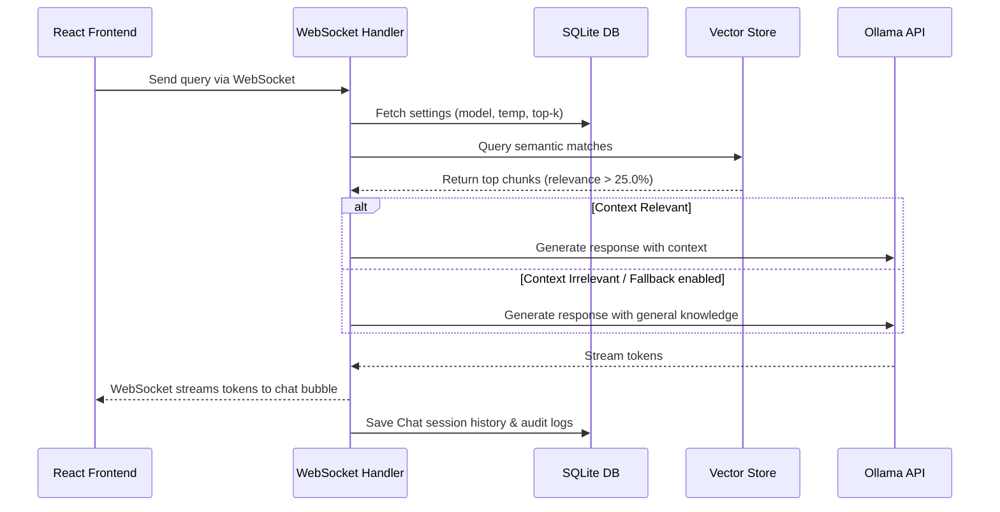

# AURA — AI Unified Retrieval Assistant 🤖📁🎙️

[](https://openjdk.org/)
[](https://spring.io/projects/spring-boot)
[](https://www.electronjs.org/)
[](https://react.dev/)
[](https://www.typescriptlang.org/)
[](https://ollama.com/)
[](https://www.sqlite.org/)

**AURA (AI Unified Retrieval Assistant)** is a 100% on-premises, privacy-first **Offline Retrieval-Augmented Generation (RAG)** application. Packaged as a premium desktop application via Electron, AURA integrates a Java Spring Boot backend engine, a local SQLite database, Python sidecar micro-utilities, and local LLM models to provide document chunking, semantic vector indexing, speech-to-text transcriptions, and visual asset indexing.

Designed for college project submissions, portfolios, and recruiter reviews, AURA ensures that zero data leaves the user's host machine.

---

## 📖 Project Overview

### Problem Statement
Enterprise document management and intelligence extraction often require uploading confidential corporate files to public LLM APIs (e.g., OpenAI, Anthropic). This poses substantial compliance risks, potential data leakage, and vulnerability to network disruptions.

### The Solution
AURA resolves these issues by hosting the entire intelligence pipeline locally:
* **Offline Processing**: Text extraction, embedding generation, database writes, and LLM inference run entirely on-premises.
* **Multimodal RAG**: Combines standard text extraction (PDF/TXT/MD), vocal recording transcriptions (Whisper), and visual semantic image retrieval (CLIP).
* **Deterministic Deployment**: Packaged into an Electron desktop container with a bundled Java Runtime Environment (JRE) and a stripped Python virtual environment.

---

## ✨ Features Checklist

- [x] **Local AI Chat & RAG**: Context-grounded chat querying a local knowledge base.
- [x] **Deterministic Fallback**: Automatically reverts to general knowledge inference if document context is absent or irrelevant (relevance score $\le$ 25.0%).
- [x] **Asynchronous Document Processing**: Async file upload workflow with status polling to prevent UI blocks on large documents (supports PDFs up to 50MB, text, and markdown).
- [x] **Vocal Recording & Transcription**: In-app recording transcribed locally using a Python sidecar calling OpenAI Whisper.
- [x] **Semantic Visual Search**: Index and query local images semantically using a Python CLIP sidecar.
- [x] **Chat History & Session Management**: Save, switch, and delete distinct chat sessions in a local SQLite database.
- [x] **System Audit Logs**: Real-time auditing of document indexations, query runs, and configuration changes.
- [x] **System Configuration Settings**: Adjust vector thresholds, sliding window sizes (chunk sizes/overlap), and temperature variables via UI.
- [x] **Dark/Light Mode Theme**: Responsive CSS grid layout with dynamic theme switching.
- [x] **Hardened System Security**: Localhost-only API bindings, strict CORS controls, and URL validation.

---

## 🛠️ Technology Stack

| Component | Technology | Version / Model | Role |
| :--- | :--- | :--- | :--- |
| **Desktop Wrapper** | Electron | `^31.0.0` | OS integration & desktop window management |
| **Frontend UI** | React / TypeScript | React `^19.0.1` / TS `~5.8.2` | Interactive, responsive SPA dashboard |
| **Styling** | Tailwind CSS / Lucide | Tailwind v4 | Modern typography, dark mode, and UI assets |
| **Backend Engine** | Spring Boot | `3.3.0` | Core API, file validation, and workflow manager |
| **Document Parser** | Apache PDFBox | `3.0.2` | Text extraction from PDF documents |
| **Relational DB** | SQLite | `3.45.3.0` via JPA | Chat sessions, settings, and logs persistence |
| **Vector Index** | ChromaDB / In-Memory | ChromaDB Python client fallback | SQLite vector storage / in-memory vector cache |
| **Speech-to-Text** | OpenAI Whisper | Python Sidecar | Speech transcription engine (CPU-optimized) |
| **Image Embedder** | CLIP | CLIP ViT-B/32 Sidecar | Semantic description & encoding for images |
| **Local LLM Server** | Ollama | System-wide CLI | Local inference engine |
| **Language Model** | LLaMA 3 | `llama3` (8B parameters) | System response generation |
| **Embedding Model** | Nomic Embed Text | `nomic-embed-text` | Dense vector text representations |

---

## 📐 System Architecture

AURA divides tasks across four distinct layers to ensure modularity and data privacy:

```mermaid
graph TD
    subgraph Client Layer [Client Layer (Electron Window)]
        UI[React SPA UI]
        Bridge[Preload Secure Bridge]
        UI <--> Bridge
    end

    subgraph Service Container [Core Container (Localhost)]
        Boot[Spring Boot Backend]
        SQL[(SQLite Database)]
        Ollama[Ollama Local LLM]
        
        subgraph Sidecars [Python Sidecars (.venv)]
            Whisper[Whisper Speech STT]
            CLIP[CLIP Visual Search]
        end
    end

    Bridge <--> |REST & WebSockets| Boot
    Boot <--> SQL
    Boot <--> |Local API Port 11434| Ollama
    Boot <--> |ProcessBuilder| Whisper
    Boot <--> |ProcessBuilder| CLIP
```

### Pipelines

#### 1. Document Indexing Pipeline


#### 2. Chat / Inference Pipeline


---

## 📁 Project Structure

```
Aura/
├── desktop/                  # Electron Desktop Wrapper Application
│   ├── main.js               # Electron main process (lifecycle, JRE startup)
│   ├── preload.js            # Secure Electron IPC preload bridge
│   ├── loading.html          # Custom loading & splash screen UI
│   ├── package.json          # Electron scripts and dependencies
│   ├── jre/                  # Bundled Java Runtime Environment (post-setup)
│   └── src/
│       ├── data/             # SQLite seed databases
│       ├── backend/          # Spring Boot Maven Project
│       │   ├── pom.xml       # Maven dependencies
│       │   └── src/main/     # Java Source code (Controllers, Services)
│       └── frontend/         # React SPA Application
│           ├── vite.config.ts # Vite configuration (proxies, hmr)
│           ├── package.json  # React scripts and dependencies
│           └── src/          # React Components, Hooks, Assets
└── README.md                 # Project Documentation
```

---

## ⚙️ Installation & Setup

### Prerequisites
* **Node.js**: v18.0 or later
* **Java Development Kit (JDK)**: JDK 21 (optional if bundled JRE is present)
* **Python**: v3.10+ (for Whisper/CLIP sidecars)
* **Ollama**: Download and install from [ollama.com](https://ollama.com)

---

### Step-by-Step Setup

#### 1. Clone the Repository
```bash
git clone https://github.com/Tharun4743/SIH25231.git
cd SIH25231
```

#### 2. Install Project Dependencies
Run in the `desktop/` directory:
```bash
cd desktop
npm install
```

#### 3. Frontend Setup
Install packages in the frontend directory:
```bash
cd src/frontend
npm install
```

#### 4. Backend Packaging
Ensure the backend JAR is packaged (this runs clean package automatically inside the build script):
```bash
cd ../backend
# Make sure Maven packages the jar
mvn clean package -DskipTests
```

---

## 🚀 Running the Application

### Running the Desktop App
To run the full desktop application in development mode with hot reloading:
```bash
cd desktop
npm start
```
This launches the Electron container, starts the custom splash screen, boots the Java backend (directing logs to the UserData folder), starts the Ollama server, and mounts the React web interface.

### Running the Web Version (Browser Only)
To run the application inside a standard web browser (bypassing the Electron wrapper):
- **Windows (Quick Start):** Run `run-web.bat` from the root directory.
- **Manual (Any platform):**
  ```bash
  cd web
  npm install
  npm run dev
  ```
Then open `http://localhost:5173` in your browser.

---

## ⚙️ Configuration File (`application.yml`)

The backend configuration is managed via `desktop/src/backend/src/main/resources/application.yml`. Important values:

```yaml
server:
  port: 8080                  # Backend port layer

spring:
  datasource:
    url: jdbc:sqlite:./data/aura.db # Sqlite local path

aura:
  ollama:
    url: http://localhost:11434 # Local Ollama instance URL
    models:
      llm: llama3             # Default inference model
      embedding: nomic-embed-text
  sidecars:
    whisper:
      script: ./sidecars/whisper_sidecar.py
      device: cpu             # Set to 'cuda' to leverage NVIDIA GPUs
    clip:
      script: ./sidecars/clip_sidecar.py
```

---

## 🔌 API Documentation

All APIs are documented via Swagger (OpenAPI) and can be accessed locally at `http://localhost:8080/swagger-ui/index.html` when the application is running.

### Key REST Endpoints

| Method | Endpoint | Description | Parameters | Response |
| :--- | :--- | :--- | :--- | :--- |
| `POST` | `/api/documents/upload` | Upload PDF/TXT/MD document for async RAG indexing | File form-data (Max 50MB) | `{"jobId": "...", "status": "PENDING"}` |
| `GET` | `/api/documents/status/{jobId}` | Poll for document indexing job state | `jobId` (String path variable) | `{"status": "COMPLETED", "chunksCreated": 12}` |
| `GET` | `/api/documents` | Fetch all successfully indexed documents | None | `[{"id": "...", "name": "..."}]` |
| `DELETE` | `/api/documents/{id}` | Delete document and related vector embeddings | `id` (String path variable) | `200 OK` |
| `POST` | `/api/images/search` | Search indexed images using visual CLIP sidecar | `{"query": "red car"}` | `[{"id": "...", "score": 28.5}]` |
| `POST` | `/api/audio/transcribe` | Upload WAV file for Whisper transcription | File form-data | `{"text": "Transcribed voice text"}` |
| `GET` | `/api/settings` | Read system settings map | None | `{"model_name": "llama3", ...}` |
| `POST` | `/api/settings` | Save settings (enforces localhost URL safety) | Key-value settings map | `{"message": "Settings saved"}` |

---

## 🔒 Security Auditing

AURA is hardened for local desktop environments:
1. **CSRF & SOP Bypass Prevention**: Restricts CORS to `http://localhost:8080` and `http://127.0.0.1:8080` only, preventing malicious websites from making credentialed requests.
2. **Localhost Restriction**: Validates settings keys (`ollama_url` and `chroma_url`) to ensure they point strictly to loopback addresses, preventing data exfiltration to external domains.
3. **Execution Sandbox**: Electron windows operate with `sandbox: true`, `contextIsolation: true`, and `nodeIntegration: false`, communicating exclusively via a narrow preload IPC bridge.

---

## 📦 Build and Packaging Instructions

To package the application into installer deliverables (executable `.exe` and Windows AppX/MSIX installer Packages):

```bash
cd desktop
npm run build
```

This runs `desktop/scripts/build.js` which:
1. Verifies/packages the Java backend.
2. Builds the React production bundle.
3. Stages JRE runtimes and datasets.
4. Generates an NSIS setup executable and an AppX package in `desktop/dist/`.
5. Outputs the final production deliverables.

---

## 🤝 Contributing

Contributions are welcome! Please follow these steps:
1. Fork the repository.
2. Create your feature branch (`git checkout -b feature/AmazingFeature`).
3. Commit your changes (`git commit -m 'Add some AmazingFeature'`).
4. Push to the branch (`git push origin feature/AmazingFeature`).
5. Open a Pull Request.

---

## 📄 License

This project is licensed under the MIT License - see the LICENSE file for details.

---

## 👥 Authors

* **Tharunkumar K** (TharunkumarK) - *Lead Developer & Architect*

---

## 💎 Acknowledgements

* [Spring Boot](https://spring.io/projects/spring-boot) for backend orchestration.
* [Electron](https://www.electronjs.org/) for the secure desktop container.
* [Ollama](https://ollama.com/) for local LLM orchestration.
* [Apache PDFBox](https://pdfbox.apache.org/) for offline text extraction.
* OpenAI for the [Whisper](https://github.com/openai/whisper) Speech model.
