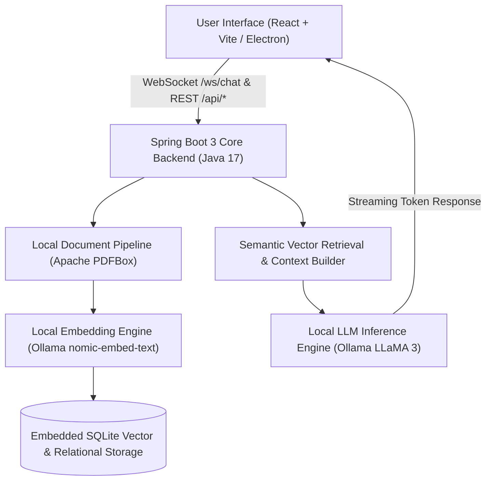

<div align="center">

# 🧠 AURA — AI Unified Retrieval Assistant
### *Air-Gapped Local Multimodal RAG Engine & Offline AI Knowledge Assistant (Desktop & Web)*

[](#)
[](#)
[](#)
[-000000?style=for-the-badge&logo=ollama&logoColor=white)](#)
[](#)
[](#)

<p align="center">
  <b>100% On-Device Document Ingestion · Local Dense Embeddings · Real-Time WebSocket Streaming · Zero Cloud Telemetry</b>
</p>

</div>

---

## 1. 📌 Problem Statement & Context

Enterprise, defense, legal, healthcare, and academic organizations face severe constraints when adopting modern generative AI:

* 🔒 **Data Privacy & Leakage Risks:** Transmitting confidential internal documents, IP, and personal records to third-party cloud LLM APIs breaches strict regulatory compliance (GDPR, HIPAA, air-gapped security mandates).
* 💸 **Escalating Cloud API Expenses:** Per-token billing models create unpredictable recurring costs when processing large multi-page document archives.
* 🌐 **Bandwidth & Connectivity Bottlenecks:** Field workers, remote personnel, and maritime/defense environments frequently operate in zero-connectivity or air-gapped settings where cloud APIs are completely unreachable.
* ⏱️ **Hallucination & Lack of Citations:** Generic models hallucinate without ground-truth semantic references pointing back to exact pages in the original documents.

---

## 2. 💡 Proposed Solution & Architectural Innovation

**AURA (AI Unified Retrieval Assistant)** is an air-gapped, privacy-first local multimodal Retrieval-Augmented Generation (RAG) platform. Engineered from the ground up to operate completely on local consumer hardware without requiring external internet access:

* 🛡️ **100% Air-Gapped Local Inference:** Executes quantized local LLMs (`llama3`) and dense embeddings (`nomic-embed-text`) entirely on-device via local Ollama. Zero network requests, zero telemetry, and zero cloud API fees.
* 📄 **Local Document Parsing & Chunking Pipeline:** Ingests PDFs locally via Apache PDFBox, segmenting text into semantic chunks with metadata tracking for page-level citations.
* ⚡ **High-Throughput Spring Boot 3 Backend:** Enterprise Java 17 service tier leveraging Spring Boot, JPA, HikariCP connection pooling, and bi-directional WebSocket streaming (`/ws/chat`) for real-time token-by-token answer generation.
* 🗄️ **Embedded SQLite Relational & Vector Storage:** Lightweight, zero-configuration database handling chat session persistence, document catalogs, and semantic vector similarity search.
* 💻 **Dual Client Distribution:** Single unified codebase supporting both a lightweight React + Vite browser interface (with Vite reverse-proxy configuration) and an Electron desktop app packaging a bundled runtime.

---

## 3. ⚙️ Technical Approach & System Architecture


```mermaid
graph TD
    User["User Interface (React + Vite / Electron)"] -->|"WebSocket /ws/chat & REST /api/*"| Gateway["Spring Boot 3 Core Backend (Java 17)"]
    Gateway --> Parser["Local Document Pipeline (Apache PDFBox)"]
    Parser --> Embedding["Local Embedding Engine (Ollama nomic-embed-text)"]
    Embedding --> DB[("Embedded SQLite Vector & Relational Storage")]
    Gateway --> Retriever["Semantic Vector Retrieval & Context Builder"]
    Retriever --> LLM["Local LLM Inference Engine (Ollama LLaMA 3)"]
    LLM -->|"Streaming Token Response"| User
```

| Architecture Layer | Technology Stack | Operational Responsibility |
| :--- | :--- | :--- |
| **Desktop Shell** | Electron 31, Node.js | Cross-platform desktop runtime, system tray, window management, bundled JRE |
| **Web Frontend** | React, Vite, Tailwind CSS | Single-page application, interactive chat UI, document upload, markdown rendering |
| **Backend Core** | Java 17, Spring Boot 3.x | REST API controllers, WebSocket chat endpoints, request validation, HikariCP |
| **Document Processing** | Apache PDFBox, Commons IO | Extract text from PDF files, page segmentation, token chunking |
| **Local Inference & RAG**| Ollama (`llama3`, `nomic-embed-text`) | On-device dense embedding generation and streaming token inference |
| **Data Storage** | SQLite JDBC, Hibernate | Local session history, document registry, embedded relational records |

---

## 4. 🚀 Getting Started

### Prerequisites
1. **Node.js** (v18+)
2. **Java Development Kit (JDK 17+)**
3. **Maven** (configured and available on system `PATH`)
4. **Ollama** running locally with the required models pulled:
   ```bash
   ollama pull llama3
   ollama pull nomic-embed-text
   ```

---

### Quick Start (Web Mode — Windows)
Double-click or run from the root directory:
```cmd
run-web.bat
```
*The script automatically verifies dependencies, checks Ollama connectivity, starts the Spring Boot backend on port `8080`, and launches the Vite frontend on port `5173` with automatic reverse proxying.*

### Manual Startup
1. **Start Backend:**
   ```bash
   cd desktop/src/backend
   mvn spring-boot:run
   ```
2. **Start Frontend:**
   ```bash
   cd web/frontend
   npm install
   npm run dev
   ```
3. Open `http://localhost:5173` in your browser.

---

## 5. 👥 Author & Development Team

* **Tharunkumar K** ([@Tharun4743](https://github.com/Tharun4743)) — *Full Stack & AI Systems Developer*
