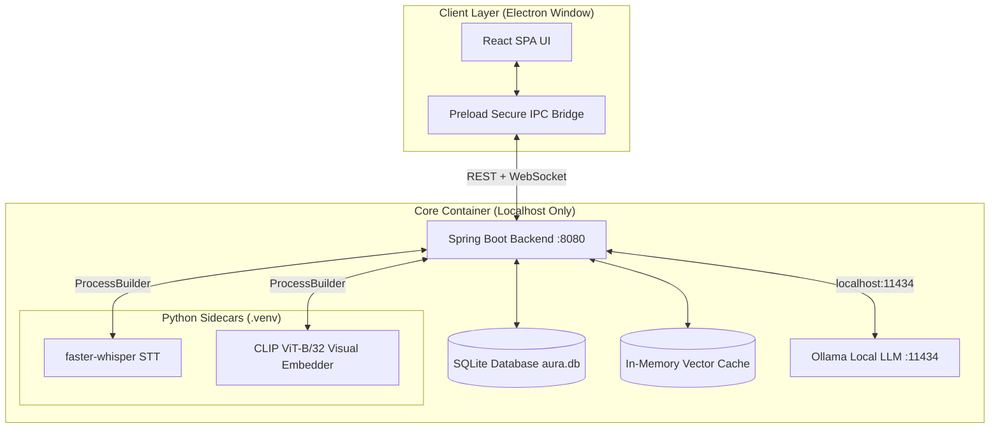
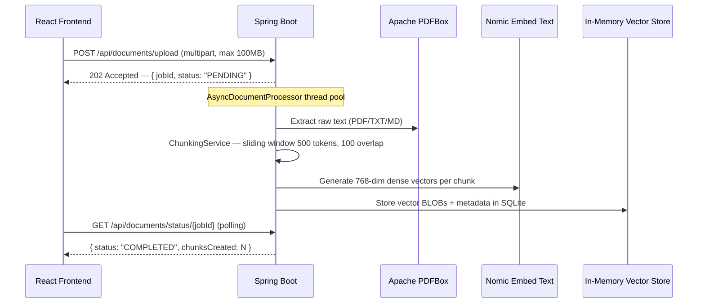
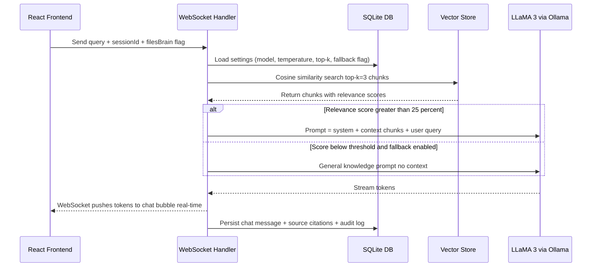

# AURA — AI Unified Retrieval Assistant

[](https://openjdk.org/)
[](https://spring.io/projects/spring-boot)
[](https://www.electronjs.org/)
[](https://react.dev/)
[](https://www.typescriptlang.org/)
[](https://ollama.com/)
[](https://www.sqlite.org/)
[](https://www.sih.gov.in/)

---

## 🎯 Project Overview

AURA is a **100% offline, privacy-first multimodal Retrieval-Augmented Generation (RAG) system** built as a standalone Windows desktop application. It enables individuals and organizations to semantically search and query their own private documents, audio recordings, and images using a local AI model — **without sending a single byte of data to the cloud**.

Designed in response to **Smart India Hackathon 2025 Problem Statement PS-25231**, AURA addresses the compliance and security gap in conventional cloud-based AI document search: sensitive organizational files should never cross an enterprise security perimeter. AURA runs LLaMA 3 (8B), Nomic Embed Text, OpenAI Whisper, and CLIP ViT-B/32 entirely on the user's machine, delivering grounded, citation-backed answers in real time with no internet connection required.

---

## 📈 Project Impact

- **Closes the security gap in AI document retrieval** — eliminates data exfiltration risks inherent in cloud-based RAG pipelines (e.g., GPT-4, Claude) by running the entire inference stack locally, including LLM, embeddings, transcription, and visual search.
- **Enables air-gapped and high-security deployments** — validated to operate under disabled Wi-Fi adapters and WAN-blocked environments, supporting genuine offline enterprise use cases that cloud APIs cannot serve.
- **Replaces fragmented, multi-tool workflows** — unifies document search, speech transcription, and visual semantic search into a single locally installed application, removing the need for separate Docker services, remote vector databases, or subscription-based APIs.
- **Eliminates per-token API costs** — all inference, embedding, and transcription run locally at zero operational transaction cost, using quantized model weights optimized for consumer CPUs without requiring a GPU.
- **Selected for Smart India Hackathon 2025** — developed as the direct technical response to SIH PS-25231, demonstrating institutional-level recognition of the problem space and solution approach.

---

## 🏆 Key Achievements

- **Smart India Hackathon 2025** — Built as the submitted solution for SIH PS-25231 (offline multimodal RAG for secure environments).
- **Full-stack multimodal pipeline** — Integrates text (PDF/TXT/MD), audio (WAV/MP3 via Whisper), and image (PNG/JPG via CLIP ViT-B/32) modalities into a unified vector retrieval system.
- **Packaged desktop installer** — Produces a standalone Windows NSIS Setup EXE and AppX/MSIX installer via electron-builder, bundling a JRE, Python `.venv`, and Spring Boot JAR — no user-level environment setup required.
- **Production-grade packaging pipeline** — Custom `build.js` script automates JRE download, Maven backend packaging, React production build, resource staging, and installer generation in a single command.
- **End-to-end validated offline operation** — Verified on air-gapped systems with no active internet connection (WAN-blocked setups), confirmed in project technical report.

---

## 🛠️ Technology Stack

| Layer | Technology | Version | Role |
| :--- | :--- | :--- | :--- |
| **Desktop Shell** | Electron | `^31.0.0` | OS integration, lifecycle management, secure IPC bridge |
| **Frontend UI** | React / TypeScript | React `^19.0.1` / TS `~5.8.2` | Interactive SPA — Chat, Library, History, Settings views |
| **Styling** | Tailwind CSS v4 / Lucide React | Tailwind v4 | Dark/light mode, responsive layout, icon library |
| **Backend Engine** | Spring Boot | `3.3.0` | REST API, WebSocket streaming, async document processor |
| **Document Parser** | Apache PDFBox | `3.0.2` | Offline text extraction from PDF documents |
| **Relational DB** | SQLite (via JPA/Hibernate) | `3.45.3.0` | Chat sessions, documents, vector chunks, audit logs, settings |
| **Vector Store** | In-Memory + ChromaDB fallback | Custom service | 768-dim dense vector storage (binary BLOBs), cosine similarity retrieval |
| **Speech-to-Text** | faster-whisper (Whisper Medium) | Python Sidecar | Offline WAV/MP3 transcription with CUDA/CPU auto-detection |
| **Image Embedder** | CLIP ViT-B/32 | Python Sidecar | Offline semantic image indexing and natural-language visual search |
| **Local LLM** | LLaMA 3 (8B) via Ollama | `llama3` | Grounded response generation, streamed via WebSocket |
| **Embeddings** | Nomic Embed Text via Ollama | `nomic-embed-text` | 768-dimensional dense text vector generation |
| **API Docs** | SpringDoc OpenAPI (Swagger UI) | `2.5.0` | Auto-generated API documentation (disabled in production) |
| **Build Tool** | Maven | `3.9.6` (bundled) | Spring Boot JAR packaging |

---

## 📐 System Architecture

AURA is built on four isolated layers that enforce data sovereignty. All communication is loopback-only; no layer connects to external networks.


```mermaid
graph TD
    subgraph "Client Layer (Electron Window)"
        UI[React SPA UI]
        Bridge[Preload Secure IPC Bridge]
        UI <--> Bridge
    end

    subgraph "Core Container (Localhost Only)"
        Boot[Spring Boot Backend :8080]
        SQL[(SQLite Database aura.db)]
        VectorStore[(In-Memory Vector Cache)]
        Ollama[Ollama Local LLM :11434]

        subgraph "Python Sidecars (.venv)"
            Whisper[faster-whisper STT]
            CLIP[CLIP ViT-B/32 Visual Embedder]
        end
    end

    Bridge <--> |REST + WebSocket| Boot
    Boot <--> SQL
    Boot <--> VectorStore
    Boot <--> |localhost:11434| Ollama
    Boot <--> |ProcessBuilder| Whisper
    Boot <--> |ProcessBuilder| CLIP
```

### Processing Pipelines

#### 1. Document Indexing Pipeline (Async — HTTP 202)


```mermaid
sequenceDiagram
    participant UI as React Frontend
    participant Boot as Spring Boot
    participant PDFBox as Apache PDFBox
    participant Embed as Nomic Embed Text
    participant Vector as In-Memory Vector Store

    UI->>Boot: POST /api/documents/upload (multipart, max 100MB)
    Boot-->>UI: 202 Accepted — { jobId, status: "PENDING" }
    Note over Boot: AsyncDocumentProcessor thread pool
    Boot->>PDFBox: Extract raw text (PDF/TXT/MD)
    Boot->>Boot: ChunkingService — sliding window 500 tokens, 100 overlap
    Boot->>Embed: Generate 768-dim dense vectors per chunk
    Boot->>Vector: Store vector BLOBs + metadata in SQLite
    UI->>Boot: GET /api/documents/status/{jobId} (polling)
    Boot-->>UI: { status: "COMPLETED", chunksCreated: N }
```

#### 2. Chat / RAG Inference Pipeline (Real-time WebSocket Streaming)


```mermaid
sequenceDiagram
    participant UI as React Frontend
    participant WS as WebSocket Handler
    participant DB as SQLite DB
    participant Vector as Vector Store
    participant Ollama as LLaMA 3 via Ollama

    UI->>WS: Send query + sessionId + filesBrain flag
    WS->>DB: Load settings (model, temperature, top-k, fallback flag)
    WS->>Vector: Cosine similarity search top-k=3 chunks
    Vector-->>WS: Return chunks with relevance scores
    alt Relevance score greater than 25 percent
        WS->>Ollama: Prompt = system + context chunks + user query
    else Score below threshold and fallback enabled
        WS->>Ollama: General knowledge prompt no context
    end
    Ollama-->>WS: Stream tokens
    WS-->>UI: WebSocket pushes tokens to chat bubble real-time
    WS->>DB: Persist chat message + source citations + audit log
```

---

## ✨ Verified Feature Set

| Feature | Implementation Evidence |
| :--- | :--- |
| **Offline RAG Chat** | `ChatWebSocketHandler.java`, `OllamaService.java`, `ChatController.java` |
| **Async Document Indexing** | `AsyncDocumentProcessor.java`, `IndexingJobService.java`, `DocumentController.java` |
| **Files Brain Toggle** | `App.tsx` — per-query toggle between RAG mode and general LLM knowledge |
| **Document-Specific Query Filter** | `App.tsx` — dropdown selects a single indexed document as the query scope |
| **Sliding Window Chunking** | `ChunkingService.java` — configurable chunk size (default 500) and overlap (default 100) |
| **Speech Transcription** | `AudioService.java`, `whisper_sidecar.py` — faster-whisper Medium model, CPU/CUDA auto-detect |
| **Semantic Visual Search** | `ImageService.java`, `clip_sidecar.py` — CLIP ViT-B/32, encode_image + encode_text actions |
| **Relevance Score Fallback** | 25% cosine similarity threshold — falls back to general knowledge if context is irrelevant |
| **Source Citations** | `SourceCitation.java`, `types.ts` — per-response citations with docName, pageNumber, excerpt, score |
| **Chat Session History** | `ChatRepository.java`, `ChatHistoryController.java` — save, resume, and delete sessions |
| **Audit Log System** | `AuditLogService.java`, `AuditLogController.java`, `AuditLog.java` — real-time event log |
| **System Settings (Live)** | `SettingService.java`, `SettingsView.tsx` — model, temperature, chunk size, top-k, fallback, ChromaDB URL |
| **NetworkGuardService** | `NetworkGuardService.java` — validates ollama_url and chroma_url are loopback-only |
| **Electron Security Sandbox** | `main.js` — contextIsolation: true, nodeIntegration: false, sandbox: true, narrow IPC bridge |
| **Dark / Light Mode** | `App.tsx`, `theme.ts`, `index.css` — persistent theme via localStorage |
| **Report AI Content Modal** | `ReportIssueModal.tsx` — flag incorrect AI responses for local audit |
| **CORS Restriction** | `CorsConfig.java` — restricted to localhost:8080 and 127.0.0.1:8080 only |
| **Swagger API Docs** | `springdoc-openapi` — auto-generated, disabled in production profile |
| **Startup Orchestration** | `main.js` — 7-step boot: Ollama detection, model pull, backend health check, UI launch |
| **Web Browser Mode** | `web/` + `vite.config.web.ts` — runs the same React app in a browser via Vite dev server |
| **Desktop Installer** | `build.js` — generates NSIS EXE + AppX MSIX for Windows x64 |

---

## 📁 Project Structure

```
Aura/
├── desktop/                        # Electron Desktop Application
│   ├── main.js                     # Electron main process — 7-step startup orchestrator
│   ├── preload.js                  # Secure contextBridge IPC preload
│   ├── loading.html                # Custom splash screen with model pull progress
│   ├── package.json                # Electron + electron-builder config (NSIS + AppX targets)
│   ├── scripts/
│   │   ├── build.js                # Full build pipeline (JRE + Maven + Vite + electron-builder)
│   │   └── download-jre.js         # JDK 21 runtime auto-downloader
│   └── src/
│       ├── data/
│       │   └── aura.db             # SQLite database (56KB seed)
│       ├── backend/                # Spring Boot Maven Project
│       │   ├── pom.xml             # Dependencies: Spring Boot, PDFBox, SQLite, SpringDoc
│       │   ├── sidecars/
│       │   │   ├── whisper_sidecar.py   # faster-whisper transcription (CPU/CUDA)
│       │   │   └── clip_sidecar.py      # CLIP ViT-B/32 image + text encoding
│       │   └── src/main/java/com/aura/
│       │       ├── config/         # CORS, WebSocket, Ollama, Async, StaticResource configs
│       │       ├── controller/     # REST: Documents, Audio, Images, Settings, AuditLog, Stats, Health
│       │       ├── model/          # JPA entities: Chat, Document, Chunk, VectorChunk, AuditLog, Setting
│       │       ├── repository/     # Spring Data JPA repositories
│       │       ├── service/        # AsyncDocumentProcessor, ChunkingService, EmbeddingService,
│       │       │                   #   OllamaService, AudioService, ImageService, AuditLogService,
│       │       │                   #   NetworkGuardService, ChromaDBService, IndexingJobService
│       │       └── websocket/      # ChatWebSocketHandler (real-time token streaming)
│       └── frontend/               # React + TypeScript SPA
│           ├── src/
│           │   ├── App.tsx         # Root app — routing, WebSocket, toasts, session management
│           │   ├── components/     # ChatWindow, LibraryView, HistoryView, SettingsView, Sidebar,
│           │   │                   #   FileUploader, AudioRecorder, MessageBubble, ReportIssueModal
│           │   ├── hooks/useWebSocket.ts  # WebSocket hook (token streaming, reconnection)
│           │   ├── services/api.ts       # Fetch wrappers: documents, audio, images, sessions
│           │   └── types.ts              # TypeScript interfaces: ChatMessage, DocumentInfo, SourceCitation
└── web/                            # Web Browser Runner
    ├── package.json                # Concurrently runs Spring Boot backend + Vite frontend
    ├── frontend/vite.config.web.ts # Vite config with backend proxy (:8080) and WebSocket proxy
    └── run-web.bat                 # Windows one-click launcher
```

---

## ⚙️ Installation & Setup

### Prerequisites

| Requirement | Version | Notes |
| :--- | :--- | :--- |
| Node.js | v18+ | For Electron and Vite |
| JDK 21 | Java 21 | Auto-bundled by the build pipeline |
| Python | 3.10+ | For Whisper and CLIP sidecars |
| Ollama | Latest | Download from [ollama.com](https://ollama.com) |

### Step-by-Step Setup

#### 1. Clone the Repository
```bash
git clone https://github.com/Tharun4743/SIH25231.git
cd SIH25231
```

#### 2. Install Desktop Dependencies
```bash
cd desktop
npm install
```

#### 3. Install Frontend Dependencies
```bash
cd src/frontend
npm install
```

#### 4. Package Spring Boot Backend
```bash
cd ../backend
mvn clean package -DskipTests
```

---

## 🚀 Running the Application

### Desktop App (Full Electron, Recommended)
```bash
cd desktop
npm start
```
Launches the Electron shell, runs the 7-step startup sequence: detects Ollama, pulls required models if missing, boots the Spring Boot JAR, polls the health endpoint, and opens the React UI.

### Web Browser Mode
**Windows (Quick Start):** Run `run-web.bat` from the root directory.

**Manual:**
```bash
cd web
npm install
npm run dev
```
Open `http://localhost:5173`. The Vite dev server proxies `/api` and `/ws/chat` to the Spring Boot backend on `:8080`.

---

## ⚙️ Configuration (`application.yml`)

```yaml
server:
  port: 8080

spring:
  datasource:
    url: jdbc:sqlite:./data/aura.db
  servlet:
    multipart:
      max-file-size: 100MB

aura:
  ollama:
    url: http://localhost:11434
    models:
      llm: llama3
      embedding: nomic-embed-text
    gpu:
      num-gpu: 0          # CPU-safe default; set to 1+ for NVIDIA GPU
      num-ctx: 4096
      temperature: 0.1
  chroma:
    top-k: 3              # Vector chunks retrieved per query
  chunk:
    size: 500             # Sliding window chunk size (tokens)
    overlap: 100          # Overlap between adjacent chunks
  sidecars:
    whisper:
      device: cpu         # Override to 'cuda' for GPU acceleration
      compute-type: int8
    clip:
      device: cpu
```

All settings are configurable at runtime via the Settings UI without restarting the application.

---

## 🔌 API Reference

Full interactive documentation at `http://localhost:8080/swagger-ui/index.html` (development mode only).

| Method | Endpoint | Description |
| :--- | :--- | :--- |
| `POST` | `/api/documents/upload` | Upload PDF/TXT/MD for async indexing (returns `jobId`) |
| `GET` | `/api/documents/status/{jobId}` | Poll indexing job state (`PENDING → COMPLETED`) |
| `GET` | `/api/documents` | List all indexed documents |
| `DELETE` | `/api/documents/{id}` | Remove document and its vector chunks |
| `POST` | `/api/images/index` | Index an image via CLIP embedding |
| `POST` | `/api/images/search` | Natural-language semantic image search |
| `POST` | `/api/audio/transcribe` | Transcribe a WAV/MP3 file via Whisper sidecar |
| `GET` | `/api/settings` | Read system configuration map |
| `POST` | `/api/settings` | Save settings (validates loopback-only URLs) |
| `GET` | `/api/logs` | Fetch system audit event log |
| `GET` | `/api/health` | Backend health check endpoint |
| `WS` | `/ws/chat` | WebSocket channel for real-time token-streaming chat |

---

## 🔒 Security Design

AURA enforces multiple layers of isolation to prevent any data from leaving the host machine:

1. **Strict CORS Policy** (`CorsConfig.java`) — Restricts allowed origins to `http://localhost:8080` and `http://127.0.0.1:8080` only, blocking CSRF and same-origin bypass attacks from external webpages.

2. **NetworkGuardService** (`NetworkGuardService.java`) — Validates `ollama_url` and `chroma_url` on every settings save, enforcing loopback-only addresses. Attempts to configure external endpoints are rejected, preventing data exfiltration through configuration.

3. **Electron Security Sandbox** (`main.js`) — All BrowserWindow instances use `contextIsolation: true`, `nodeIntegration: false`, and `sandbox: true`. All host communication routes through a narrow `contextBridge` IPC preload.

4. **Offline Model Environment Flags** — Python sidecars set `TRANSFORMERS_OFFLINE=1` and `HF_DATASETS_OFFLINE=1`, blocking any runtime Hugging Face model download attempts.

5. **Production API Doc Lockdown** — Swagger UI and OpenAPI endpoints are disabled in the `prod` Spring profile, preventing API surface exposure in packaged builds.

---

## 📦 Build & Packaging

```bash
cd desktop
npm run build
```

`build.js` runs a full automated pipeline:

1. Downloads JDK 21 JRE if not present
2. Builds the React frontend production bundle
3. Packages the Spring Boot backend JAR via Maven
4. Stages artifacts into a temporary build tree
5. Copies JRE, backend JAR, frontend `dist/`, Python `.venv`, and SQLite data
6. Runs `electron-builder` to produce:
   - **NSIS Setup EXE** — standard Windows installer (x64)
   - **AppX / MSIX** — Microsoft Store-compatible installer (`minVersion: 10.0.19041.0`)
7. Cleans build residue, leaving only final installers in `desktop/dist/`

---

## 📄 Resume-Ready Impact

> **Built a fully offline, multimodal RAG desktop application as the technical solution to Smart India Hackathon 2025 (PS-25231), integrating LLaMA 3, Nomic Embed Text, OpenAI Whisper, and CLIP ViT-B/32 into a single locally-installed Windows application that performs document search, voice transcription, and semantic image retrieval with zero cloud dependency.**

> **Engineered a five-layer full-stack system spanning React/TypeScript (Electron frontend), Java Spring Boot (REST + WebSocket backend), SQLite (vector + relational storage), and Python sidecar processes — packaged into a single-file Windows installer via a custom build pipeline that automates JRE bundling, Maven compilation, and electron-builder packaging.**

> **Designed and implemented end-to-end data sovereignty guarantees through strict CORS origin controls, a NetworkGuardService that enforces loopback-only URLs, Electron context isolation, and offline model environment flags — validated to operate on air-gapped machines with no active internet connection.**

---

## 🤝 Contributing

Contributions are welcome!

1. Fork the repository
2. Create your feature branch (`git checkout -b feature/AmazingFeature`)
3. Commit your changes (`git commit -m 'Add some AmazingFeature'`)
4. Push to the branch (`git push origin feature/AmazingFeature`)
5. Open a Pull Request

---

## 📄 License

This project is licensed under the MIT License.

---

## 👤 Author

**Tharunkumar K** — Lead Developer & Architect
B.Tech Information Technology, V.S.B. Engineering College, Karur
Smart India Hackathon 2025 — PS-25231

---

## 💎 Acknowledgements

- [Spring Boot](https://spring.io/projects/spring-boot) — Backend orchestration
- [Electron](https://www.electronjs.org/) — Secure desktop container
- [Ollama](https://ollama.com/) — Local LLM and embedding inference
- [Apache PDFBox](https://pdfbox.apache.org/) — Offline PDF text extraction
- [faster-whisper](https://github.com/SYSTRAN/faster-whisper) — Optimized offline speech recognition
- [OpenAI Whisper](https://github.com/openai/whisper) — Underlying speech model weights
- [CLIP (OpenAI)](https://github.com/openai/CLIP) — Contrastive image-text embedding model
- [Nomic Embed Text](https://www.nomic.ai/) — Local 768-dim text embedding model
