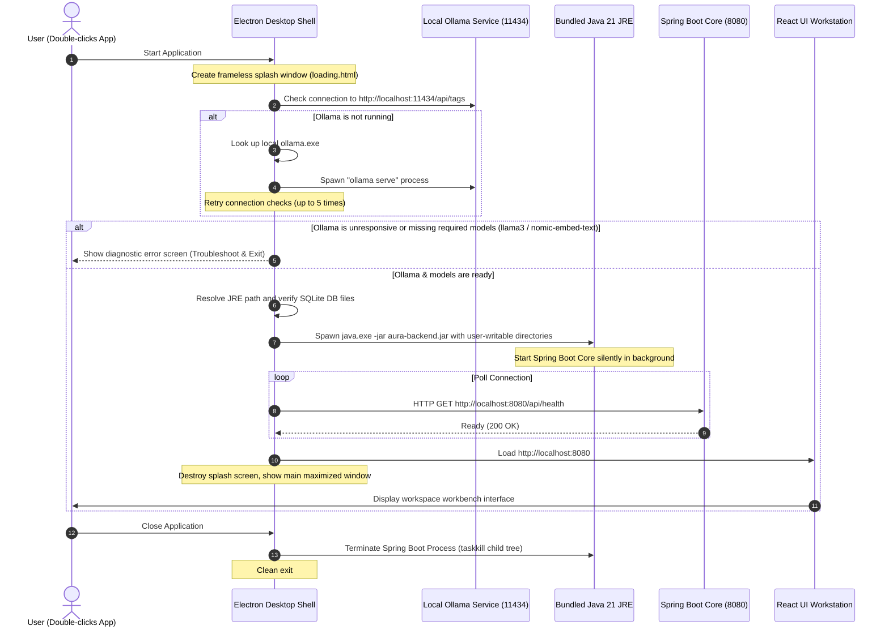

# Aura - AI unified retrival assistant Desktop Application Setup & Deployment Guide

This guide details how to build, install, and run the packaged offline desktop version of the **Aura - AI unified retrival assistant** on Windows 10 and 11.

---

## 🏗️ Release Folder Structure

Once built, the final application binaries and package configuration files are organized in the following release layout:

```text
aura-desktop-release/
├── AURA Desktop Setup 1.0.0.exe   # Single-click setup installer (.exe)
├── AURA Desktop 1.0.0.exe         # Standalone portable workstation (.exe)
├── install_instructions.md        # This installation and deployment guide
└── build_scripts/                 # Automation scripts to compile release assets
    ├── build.js
    └── download-jre.js
```

---

## ⚡ Runtime Startup Sequence Diagram

The following sequence diagram outlines how the desktop wrapper manages background processes, checks dependencies, and launches the user interface:



---

## 📦 Building the Installer and Portable Binaries

To build a fresh release from source:

1. **Open PowerShell** in the project's root folder:
   ```powershell
   cd c:\Users\tharu\Downloads\aura---augmented-unified-retrieval-assistant
   ```
2. **Execute the Build Script** inside the `desktop/` directory:
   ```powershell
   node desktop/scripts/build.js
   ```
   
   This script will automatically:
   - Compile the React static site bundle.
   - Package the Spring Boot JAR with Maven.
   - Fetch the Temurin OpenJDK JRE 21.
   - Stage all assets (.venv, models, static frontend, backend).
   - Execute `electron-builder` to generate the installer and portable binaries.
   - Clean up workspace build duplicates.

3. **Find Deliverables** in `desktop/dist/`:
   - `AURA Desktop Setup 1.0.0.exe` (Installer)
   - `AURA Desktop 1.0.0.exe` (Portable)

---

## 🚀 Installation & Usage Guide

### Single-Click Installer (.exe)
1. Double-click `AURA Desktop Setup 1.0.0.exe`.
2. The installation will run silently and install the application under the user's local AppData directory (`%LOCALAPPDATA%/Programs/aura-desktop/`).
3. An **AURA Desktop** shortcut will be created on the **Desktop** and in the **Start Menu**.
4. The application will start automatically.

### Portable Workstation (.exe)
1. Copy `AURA Desktop 1.0.0.exe` anywhere (e.g. desktop, USB, folder).
2. Double-click to launch. It runs out of the directory it is placed in, storing user settings/uploads inside `%APPDATA%/aura-desktop/`.

---

## 🛠️ Diagnostics & Troubleshooting

* **Ollama Service Errors**:
  If the application fails with "Ollama is not running":
  1. Open Ollama on your system.
  2. Run `ollama list` in command prompt to verify `llama3` and `nomic-embed-text` are downloaded. If not, pull them:
     ```bash
     ollama pull llama3
     ollama pull nomic-embed-text
     ```
* **Performance / Inference Falling Back**:
  By default, Whisper and CLIP sidecars search for a CUDA-compatible GPU. If not found, they fall back to CPU. Ensure your GPU drivers are up to date.
* **Logs & Databases**:
  - The SQLite database file is safely maintained at: `%APPDATA%/aura-desktop/data/aura.db`.
  - Uploaded documents are saved under: `%APPDATA%/aura-desktop/uploads/`.
  - Spring Boot backend runtime log can be reviewed at: `%APPDATA%/aura-desktop/logs/backend.log`.
